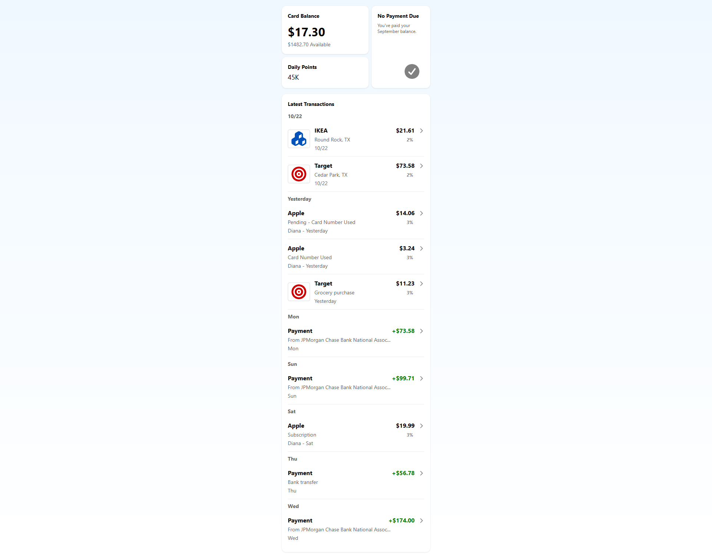
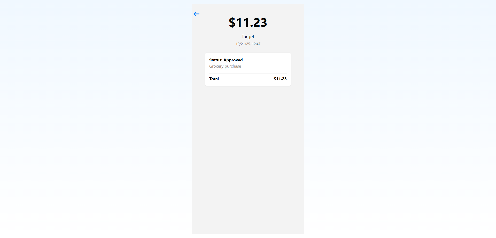

# Test Task: Wallet App

The project should be built with ReactJs and TypeScript. The app should follow the mobile layout requirements. 

The app should have two main screens:

- TransactionsList
- TransactionDetail

### Task

The app should fetch data from the JSON file in the assets folder.

### Transactions List

This is the home screen of the app. It should include the following blocks:

- Card Balance Block
- No Payment Due Block
- Daily Points Block
- Latest Transactions Block

### Card Balance Block

- Maximum card limit: $1500
- Available limit = max limit - current balance
- Display current balance and available limit

### No Payment Due Block

- Displays "You've paid your balance."
- Display a checkmark icon

### Daily Points Block

- Displays today's points calculation [formula]

### Latest Transactions Block

- Shows 10 transactions
- Each transaction card displays:
  - Type ("Payment")
  - Amount (with "$")
  - Name (e.g., "Target")
  - Description
  - Date (day name for last week)

- If the transaction is pending, display "Pending" before the description.
- If authorized by another person, display their name before the date (e.g., "Diana - Yesterday")

### Transaction Properties

- Type: "Payment" (card top-up amount displayed with a "+")
- Amount
- Name
- Transaction Description (any text)
- Date: For the last week, display the day name

### Calculating Daily Points

- Points depend on the current day of the season (spring, winter, etc.).
- On the first day of the season (e.g., September 1): the user gets 1 point.
- On the second day of the season, the user gets 2 points.
- On the third and subsequent days, the user gets:
  - 100% of the points from the day before the previous one plus
  - 1% of the points from the previous day.
- Example: On September 3, the player gets 60% of September 1 points 100% of September 2 points (e.g., 26.74).
- The points are displayed, e.g., 45.6K

### Transaction Detail

When clicking on any transaction in the TransactionsList, a screen opens showing ALL the transaction details from that transaction card. An example is shown below in the screenshot.

### Screenshots

Home Screen:

Transaction Detail Screen:

### Setup Instructions

1. Clone the repository: `git clone https://github.com`
2. Install dependencies: `npm install`
3. Run the app: `npm run dev`

### Usage

- The app loads data from `public/data.json`.
- Navigate to a transaction detail by clicking on a transaction in the latest transactions list.

### Calculating Daily Points (Detailed)

- For simplicity, use a random dark background - a standard gradient class.
- The formula is as per the spec. The override is used for demo to match the screenshot.

### Authorized User

- For older entry, display the date
- If the transaction is pending, display "Pending" before the description (see the first and third transactions).
- If authorized by another person, display their name before the date (e.g., for the 1st and 3rd transactions).

### Use FontAwesome for icons (logos)

The icons are from FontAwesome free set. 

This README documents the Wallet App test task implementation.